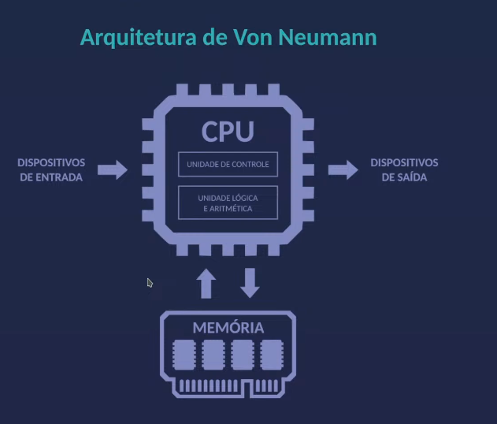
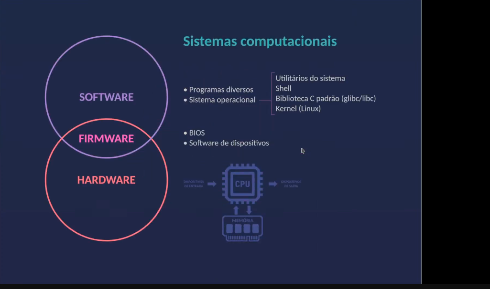

## Noções básicas desejáveis
- Programação em linguagens procedurais
- Lógica Booleana (`!`)
- Aritmérica com números binários
- Arquiteturas de Hardware (`!`)
- Sistemas operacionais UNIX-like (`!`)
- Operação do GNU/Linux pelo shell
- Programação em C/C++

## Por que aprender assembly?
- Entender como os programas funcionam
- Entender como o sistema operacional funciona
- Entender como o hardware funciona
- Otimização de programas
- Engenharia reversa e testes de segurança
- Programação "bare metal"
- Programação de microcontroladores
- Programação de drivers

## Assembly e diferente de tudo!
- Um passo de cada vez
- Não existe o conceito de tipos de dados
- Não existem estruturas de decisão e repetição
- Não existem variáveis nem parâmetros

O objetivo é manipular dados na memória principal e nos registradores com as instruções da CPU

1 bit (binary digit):

01010011

8 bits = 1 byte

Quandos temos 2 bytes, chamamos de palavra (word)

No final das contas é tudo número

## Um programa escrito em código de máquina

## Executando o arquivo ok

### Retornando erro 69, por contao do 45 na linha 6

Podemos retornar 0 - 255 (0 - FF (HEX))

#### Para imprimir 0, o computador tem que receber o código do caracter zero, que é 30 em base 16

## Código em Assembly

## O que é Assembly?

