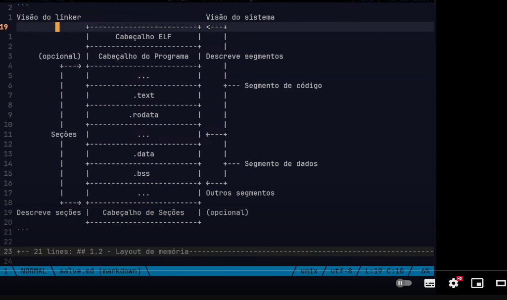

## Seções e segmentos do código

- Seções são uma forma de organizar os dados escritos no arquivo binário *durante a ligação*

- Os segmentos, suas contrapartes, descrevem dados conforme seão vistos *durante a execução* pelo sistema operacional

- Podemos criar quantas seções quisermos, na ordem que quisermos e com os nomes que quisermos.

As *seções padrão* são aquelas que terão seus atributos configurados pelo _assemblador_

Uma seção no arquivo objeto nada mais é que uma maneira de agrupar dados no arquivo. É como criar um grupo novo e dar um sentido para ele. Três exemplos principais de seções são:

- A seção de código, onde o código que é executado pelo processador fica.

- Seção de dados, onde variáveis são alocadas.

- Seção de dados não inicializada, onde a memória será alocada dinamicamente ao carregar o executável na memória. Geralmente usada para variáveis não inicializadas, isto é, variáveis que não têm um valor inicial definido.

### 1.1 Arquivo binário elf



Existem quatro seções principais que podemos usar no nosso código e o linker irá resolvê-las corretamente sem que nós precisamos dizer a ele como fazer seu trabalho. O NASM também reconhece essas seções como "padrão" e já configura os atributos delas corretamente.

- .text -- Usada para armazenar o código executável do nosso programa.

- .data -- Usada para armazenar dados inicializados do programa, por exemplo uma variável global.

- .bss -- Usada para reservar espaço para dados não-inicializados, por exemplo uma variável global que foi declarada mas não teve um valor inicial definido.

- .rodata ou .rdata -- Usada para armazenar dados que sejam somente leitura (readonly), por exemplo uma constante que não deve ter seu valor alterado em tempo de execução.

## Stack

Processadores da arquitetura x86 tem uma implementação nativa de uma pilha, que é representada na memória RAM, onde essa pode ser manipulada por instruções específicas da arquitetura ou diretamente como qualquer outra região da memória. Essa pilha normalmente é chamada de hardware stack.

O registrador SP/ESP/RSP, Stack Pointer, serve como ponteiro para o topo da pilha podendo ser usado como referência inicial para manipulação de valores na mesma. Onde o "topo" nada mais é que o último valor empilhado. Ou seja, o Stack Pointer está sempre apontando para o último valor na pilha.

A Stack é uma área de memória usada para armazenar contextos temporários da execução do programa, principalmente relacionados a funções:

- Parâmetros de função

- Variáveis locais

- Endereço de retorno (quando a função termina)

- Stack frames (contexto de execução)

Cresce para baixo

Gerenciamento:

- Feita automaticamente pelo compilador e pela CPU.

- Quando uma função é chamada: um novo frame é empilhado.

- Ao sair da função: o frame é removido (desempilhado).

## Heap

A Heap é uma região usada para alocação dinâmica de memória. Ou seja, quando você precisa de memória em tempo de execução, sem saber o tamanho exato durante a compilação.

Cresce para cima, em direção à stack

Para alocar memória dinamicamente ao executar nosso código, e não como variáveis, usaremos o heap do programa. Não precisamos saber exatamente como ele funciona, mas para deixar claro: é uma área do nosso código em execução (thread ou processo) que nos permite alocar memória dinamicamente. Não é infinito, mas é mais do que suficiente para a maioria das partes! Portanto, usaremos instruções para alocar memória de um tamanho específico de byte e, posteriormente, armazenar nesse novo local de memória alocado tudo o que desejarmos.

Riscos:
- Memory Leak: esquecer de liberar memória.

- Heap Overflow: alocar tanta memória que invade outras áreas (inclusive a stack).

Como os dois crescem em direções opostas, se o programa for muito exigente (como chamadas recursivas infinitas ou alocações gigantescas), eles podem se encontrar no meio da RAM do processo e causar falhas.


## Explicando código

```asm
msg: db "Salve, simpatia", 10
```

- ```msg```: é um rótulo (label). Ele nomeia um endereço de memória, que pode ser usado para se referir a esse dado depois 

- ```db```: significa "define byte" — ele diz ao montador (assembler) para armazenar bytes específicos na memória.

- ```"Salve, simpatia"```: é a string que está sendo armazenada. Cada caractere é convertido em seu valor ASCII e armazenado byte a byte.

- ```10```: é o valor decimal para newline (\n) em ASCII, ou seja, quebra de linha.

Essa linha coloca na memória, a partir do rótulo msg, a seguinte sequência de bytes:

```'S' 'a' 'l' 'v' 'e' ',' ' ' 's' 'i' 'm' 'p' 'a' 't' 'i' 'a' '\n'```
Ou em ASCII decimal:

```83 97 108 118 101 44 32 115 105 109 112 97 116 105 97 10```

```asm
len: equ $ - msg
```

```len```: é um rótulo constante (um label associado a um valor fixo)

```equ```: significa "equivale a" - define um valor constante no momento da montagem

```$```: representa o endereço atual (posição atual no código, ou seja, o próximo byte a ser definido)

```msg```: é o endereço do início da string

Essa linha está dizendo ao montador:

“Crie uma constante chamada len que representa o comprimento da string começando em msg.”